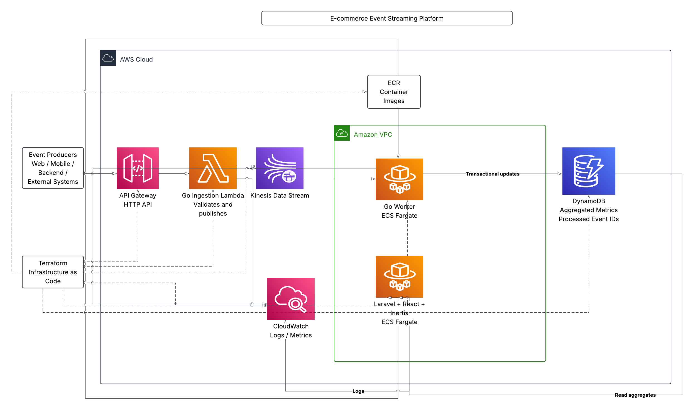

# **E-commerce Event Streaming Platform — AWS, Go, Laravel, React**

This is a event streaming and analytics platform for ingesting and aggregating e-commerce events in near real time. Events are received through an API Gateway endpoint and processed by a Go Lambda function before being published to Amazon Kinesis.

A Go worker running on ECS Fargate consumes the event stream and writes aggregated metrics to DynamoDB. The results are displayed through a Laravel, React and Inertia dashboard. The AWS infrastructure is managed with Terraform and CloudWatch used for monitoring and observability.

## Architecture


## Running Locally

The recommended development environment is the included Dev Container, which provides all required tooling.

The project can also be run directly on the host machine if the following are installed:

- Docker and Docker Compose
- Go 1.27.1
- Terraform
- AWS CLI
- PHP and Composer
- Node.js and npm
- Make
- Zip

Once the dependencies are installed:

```bash
make infra-up
make ingest-build
make tf-init
make tf-apply
make worker-deploy
```

Start the dashboard:
```bash
make dashboard
make frontend
```
